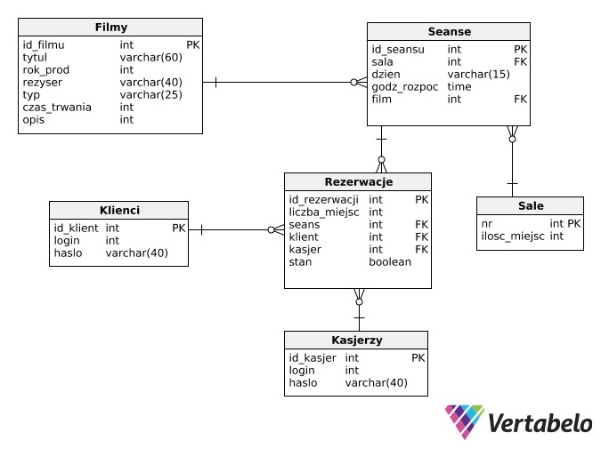

## Arthouse Cinema Service

The aim of the project was to create an _infrastructure_ for a small arthouse cinema, which was to include the creation of a **database** and a **website** through which _clients_ could be properly served by _casiers_.
 
 
The project was implemented using PostgreSQL, PHP and HTML.
 
 
The project can be divided into two main tasks, which can be divided into stages.
<ul>
<li>database design
<ul>
<li>database form pre-planning</li>
<li>create an ERD diagram</li>
<li>transformation of a conceptual model into a relational model</li>
</ul>
</li>
<li>creating a website
<ul>
<li>user registration</li>
<li>repertoire overview</li>
<li>making a reservation</li>
</ul>
</li>
</ul>

The database was designed in accordance with the general principles of designing relational databases, however, keeping in mind that elegant and textbook design principles should not conflict with the convenience of using the database. The final form of the base can be read from the diagram below
 

 
(Sorry for the Polish language, but at the time of preparing the project, I did not plan to post it on GitHub. This idea appeared much later.)
In addition, the databases have been equipped with triggers that ensure the appropriate quality of the database, e.g. they check the compliance of the password and login with the necessary conditions.

The website was prepared by myself with the help of internet forums. It is minimalistic and easy to use, but prepared in such a way as to make its use as easy as possible for users and to exclude the possibility of negative actions by malicious users.
 
 
The website enables:
* user registration in the system
* review of the repertoire for a selected day of the week
* review of film premieres
* making a reservation for a selected movie
* checking the status of your reservations
 

In addition, _cashiers_ have the option of:
* review of ordered bookings
* acceptance of the selected booking
* cancellation of the selected booking

In the  <a href="/sql">sql</a> catalog there are database scripts. 
The <a href="/sql/script_database.sql">script_database.sql</a> file is the database creation script with a set of triggers. 
The <a href="/sql/insert.sql">insert.sql</a> file contains database inserts. The descriptions of the films come from the website www.filmweb.pl.

